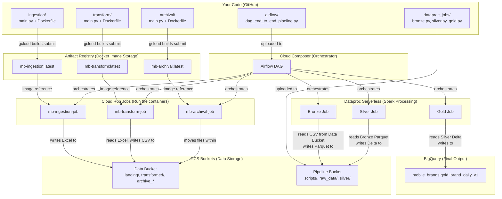

# 🗺️ PD Environment Deployment — Complete Overview & Guide

> **PD Project:** `pd-env-495516` | **Region:** `us-central1`

## Table of Contents
1. [What Is This Project?](#what-is-this-project)
2. [The Big Picture — How Everything Connects](#the-big-picture)
3. [What You Created in DV — And WHY](#what-you-created-in-dv)
4. [What Needs to Be Done for PD — Step by Step](#pd-deployment-steps)
5. [Key Differences: DV vs PD](#dv-vs-pd-differences)
6. [Checklist](#checklist)

> [!NOTE]
> **Cloud Build CI/CD is excluded from this guide.** This covers manual deployment only. Cloud Build can be set up later.

---

## What Is This Project?

You built an **end-to-end data pipeline** that processes mobile brand sales data across 6 countries. The pipeline runs daily and goes through these stages:

```
📥 Ingestion → 🔄 Transform → 🥉 Bronze → 🥈 Silver → 🥇 Gold → 📦 Archive
```

| Stage | What It Does | Runs On |
|---|---|---|
| **Ingestion** | Generates fake Excel files (one per distributor per country) and uploads them to GCS `landing/` folder | Cloud Run Job |
| **Transform** | Reads Excel files, splits by brand sheet, saves as CSV to GCS `transformed/` folder | Cloud Run Job |
| **Bronze** | Reads CSVs → writes raw Parquet files partitioned by date | Dataproc (PySpark) |
| **Silver** | Reads Bronze Parquet → deduplicates → writes Delta Lake table | Dataproc (PySpark) |
| **Gold** | Reads Silver Delta → enriches with BigQuery dimensions → writes to BigQuery | Dataproc (PySpark) |
| **Archive** | Moves processed files from `landing/` and `transformed/` to dated archive folders | Cloud Run Job |

**Airflow** (Cloud Composer) orchestrates all of this — runs daily at 01:00 UTC.

---

## The Big Picture

Here's how every GCP resource connects together:



---

## What You Created in DV — And WHY

Here's everything you set up in the DV environment, **what it is**, and **why you needed it**:

### 1. 🔑 Enabled GCP APIs
**What:** Turned on specific Google Cloud services (Cloud Run, Dataproc, Composer, etc.)
**Why:** GCP disables services by default. You must explicitly enable each API before you can use it. Without this, every `gcloud` command for that service would fail.

### 2. 🐳 Artifact Registry Repository (`mb-repo`)
**What:** A private Docker image storage location (like a private Docker Hub) inside your GCP project.
**Why:** Your 3 Cloud Run Jobs (ingestion, transform, archival) each run from a Docker container. You need somewhere to store those Docker images. Artifact Registry is where GCP looks for images when deploying Cloud Run Jobs.

> **Think of it like:** A private app store where you publish your containerized applications.

### 3. 👤 Service Account (`mb-pipeline-sa`)
**What:** A "robot user" that your pipeline components use to authenticate with GCP services.
**Why:** Cloud Run Jobs, Dataproc jobs, and Airflow all need permission to:
- Read/write to GCS buckets
- Submit Dataproc jobs
- Write to BigQuery
- Write logs

Instead of using your personal account, you create a dedicated service account with exactly the permissions needed.

> **Think of it like:** A dedicated employee ID card that only has access to the rooms it needs.

### 4. 🔐 IAM Role Bindings
**What:** Permissions assigned to the service account.
**Why:** Each role grants specific capabilities:

| Role | What It Allows |
|---|---|
| `storage.objectAdmin` | Read/write files in GCS buckets |
| `dataproc.editor` | Create and run Dataproc Spark jobs |
| `bigquery.dataEditor` | Insert/update data in BigQuery tables |
| `bigquery.jobUser` | Run BigQuery queries |
| `run.developer` | Execute & monitor Cloud Run Jobs |
| `logging.logWriter` | Write application logs |

### 5. 🪣 GCS Buckets (2 buckets)

#### Data Bucket (DV: `mb-data-dev-496908` → PD: `mb-data-pd-495516`)
**What:** Stores all the data files flowing through the pipeline.
**Why:** This is where:
- `landing/` → Ingestion writes generated Excel files here
- `transformed/` → Transform writes converted CSVs here
- `archive_landing/` → Archive moves old Excel files here
- `archive_transformed/` → Archive moves old CSVs here

#### Pipeline Bucket (DV: `mb-pipeline-dev-496908` → PD: `mb-pipeline-pd-495516`)
**What:** Stores PySpark scripts and intermediate processed data.
**Why:** This is where:
- `scripts/` → bronze.py, silver.py, gold.py live (Dataproc reads them from here)
- `raw_data/` → Bronze layer Parquet files (partitioned by date)
- `silver/` → Silver layer Delta Lake table

> **Why 2 separate buckets?** Separation of concerns: one for raw/operational data, one for the pipeline engine and processed data.

### 6. 📊 BigQuery Dataset (`mobile_brands`)
**What:** A container/namespace in BigQuery that holds your tables.
**Why:** The Gold layer writes the final aggregated table (`gold_brand_daily_v1`) here. BigQuery requires a dataset to exist before you can write tables to it.

### 7. 🐳 Docker Images (3 images)
**What:** Packaged versions of your Python code + dependencies for each Cloud Run Job.
**Why:** Cloud Run runs containers, not raw Python files. Each Dockerfile:
1. Starts from a Python base image
2. Installs `requirements.txt` dependencies
3. Copies your `main.py` and `config/` folder
4. Sets the startup command

| Image | Source Folder | Purpose |
|---|---|---|
| `mb-ingestion:latest` | `./ingestion` | Generates Excel files |
| `mb-transform:latest` | `./transform` | Converts Excel → CSV |
| `mb-archival:latest` | `./archival` | Archives processed files |

> **In DV you used `gcloud builds submit`** (Cloud Build) to build images because direct `docker push` from Cloud Shell had connection issues. This is actually the recommended production approach.

### 8. ☁️ Cloud Run Jobs (3 jobs)
**What:** Serverless containers that run on-demand (not always running).
**Why:** Each job runs a specific pipeline stage. Cloud Run Jobs:
- Start, do their work, then stop (you only pay for execution time)
- Are triggered by Airflow (or manually via `gcloud run jobs execute`)
- Read config from environment variables (`BUCKET_NAME`, `ENV`)

| Job Name (DV) | Image | What It Does |
|---|---|---|
| `mb-ingestion-job` | `mb-ingestion:latest` | Generates Excel → GCS landing/ |
| `mb-transform-job` | `mb-transform:latest` | Excel → CSV → GCS transformed/ |
| `mb-archival-job` | `mb-archival:latest` | Moves files to archive folders |

### 9. ⚡ Dataproc PySpark Scripts (uploaded to GCS)
**What:** Three Python scripts that Dataproc Serverless runs as Spark jobs.
**Why:** You upload them to GCS (`gs://<PIPELINE_BUCKET>/scripts/`) because Dataproc Serverless reads the script from a GCS path — it doesn't have access to your local filesystem or GitHub directly.

### 10. 🎵 Cloud Composer / Airflow
**What:** A managed Apache Airflow service that orchestrates the entire pipeline.
**Why:** Without Composer, you'd have to manually trigger each step in sequence. Airflow:
- Runs the DAG on a schedule (daily at 01:00 UTC)
- Handles step dependencies (transform waits for ingestion, etc.)
- Sends failure/success emails
- Provides a web UI to monitor runs

The DAG file reads Airflow Variables (like `MB_ENV`, `MB_PROJECT_ID`, etc.) so the same code works for both DV and PD.

---

## PD Deployment Steps

> **Project ID:** `pd-env-495516`
> **`pd-env` branch:** ✅ exists in GitHub
> ⚠️ **Run all commands in Cloud Shell.** If session restarts, re-run Block 1 first.

---

### 🔶 Phase 1: One-Time GCP Setup (Run once in PD project)

These create the infrastructure that your pipeline will use.

#### Step 1.1 — Set PD Environment Variables
```bash
export PROJECT_ID="pd-env-495516"
export REGION="us-central1"
export SOURCE_BUCKET="mb-data-pd-495516"
export PIPELINE_BUCKET="mb-pipeline-pd-495516"
export SA_EMAIL="mb-pipeline-sa@${PROJECT_ID}.iam.gserviceaccount.com"
export REGISTRY="${REGION}-docker.pkg.dev/${PROJECT_ID}/mb-repo"

gcloud config set project $PROJECT_ID
```

✅ Verify: `echo $PROJECT_ID` → should print `pd-env-495516`

#### Step 1.2 — Enable APIs
```bash
gcloud services enable \
  run.googleapis.com \
  dataproc.googleapis.com \
  composer.googleapis.com \
  container.googleapis.com \
  artifactregistry.googleapis.com \
  cloudbuild.googleapis.com \
  bigquery.googleapis.com \
  storage.googleapis.com
```

#### Step 1.3 — Create Artifact Registry
```bash
gcloud artifacts repositories create mb-repo \
  --repository-format=docker \
  --location=$REGION \
  --description="Mobile Brands pipeline Docker images"
```

#### Step 1.4 — Create Service Account + Roles
```bash
# Create the service account
gcloud iam service-accounts create mb-pipeline-sa \
  --display-name="Mobile Brands Pipeline SA"

# Grant all required roles
for ROLE in \
  roles/storage.objectAdmin \
  roles/dataproc.editor \
  roles/dataproc.worker \
  roles/bigquery.dataEditor \
  roles/bigquery.jobUser \
  roles/bigquery.readSessionUser \
  roles/run.developer \
  roles/composer.worker \
  roles/iam.serviceAccountUser \
  roles/logging.logWriter; do
  gcloud projects add-iam-policy-binding $PROJECT_ID \
    --member="serviceAccount:$SA_EMAIL" \
    --role="$ROLE"
done

# Grant Composer Service Agent permission to use the custom service account
export PROJECT_NUMBER=$(gcloud projects describe $PROJECT_ID --format="value(projectNumber)")

gcloud iam service-accounts add-iam-policy-binding $SA_EMAIL \
  --member="serviceAccount:service-${PROJECT_NUMBER}@cloudcomposer-accounts.iam.gserviceaccount.com" \
  --role="roles/composer.ServiceAgentV2Ext"

# Grant Editor role to Google APIs Service Agent
gcloud projects add-iam-policy-binding $PROJECT_ID \
  --member="serviceAccount:${PROJECT_NUMBER}@cloudservices.gserviceaccount.com" \
  --role="roles/editor"
```

#### Step 1.5 — Create GCS Buckets
```bash
gcloud storage buckets create gs://$SOURCE_BUCKET \
  --location=$REGION \
  --uniform-bucket-level-access

gcloud storage buckets create gs://$PIPELINE_BUCKET \
  --location=$REGION \
  --uniform-bucket-level-access
```

#### Step 1.6 — Create BigQuery Dataset
```bash
bq --location=$REGION mk \
  --dataset \
  --description="Mobile Brands gold layer" \
  ${PROJECT_ID}:mobile_brands
```

> [!IMPORTANT]
> **If you have BigQuery dimension tables** (`dim_date`, `dim_market`, `product_v2`, `customer`) in DV, you need to also create/copy them to the PD BigQuery dataset. The Gold layer reads these tables. Without them, the Gold job will fail.

---

### 🔶 Phase 2: Build & Deploy

#### Step 2.1 — Build & Push Docker Images
```bash
# Build & push ingestion image
gcloud builds submit ./ingestion \
  --tag ${REGISTRY}/mb-ingestion:latest

# Build & push transform image
gcloud builds submit ./transform \
  --tag ${REGISTRY}/mb-transform:latest

# Build & push archival image
gcloud builds submit ./archival \
  --tag ${REGISTRY}/mb-archival:latest
```

✅ Verify: `gcloud artifacts docker images list ${REGISTRY}` → should show 3 images

#### Step 2.2 — Create Cloud Run Jobs
```bash
# Ingestion Job
gcloud run jobs create mb-ingestion-job \
  --image ${REGISTRY}/mb-ingestion:latest \
  --region $REGION \
  --service-account $SA_EMAIL \
  --set-env-vars BUCKET_NAME=$SOURCE_BUCKET,ENV=pd

# Transform Job
gcloud run jobs create mb-transform-job \
  --image ${REGISTRY}/mb-transform:latest \
  --region $REGION \
  --service-account $SA_EMAIL \
  --set-env-vars BUCKET_NAME=$SOURCE_BUCKET,ENV=pd

# Archival Job
gcloud run jobs create mb-archival-job \
  --image ${REGISTRY}/mb-archival:latest \
  --region $REGION \
  --service-account $SA_EMAIL \
  --set-env-vars BUCKET_NAME=$SOURCE_BUCKET,ENV=pd
```

✅ Verify: `gcloud run jobs list --region=$REGION` → should show 3 jobs

#### Step 2.3 — Upload PySpark Scripts
```bash
gcloud storage cp dataproc_jobs/bronze.py gs://${PIPELINE_BUCKET}/scripts/bronze.py
gcloud storage cp dataproc_jobs/silver.py gs://${PIPELINE_BUCKET}/scripts/silver.py
gcloud storage cp dataproc_jobs/gold.py   gs://${PIPELINE_BUCKET}/scripts/gold.py

# Verify
gcloud storage ls gs://${PIPELINE_BUCKET}/scripts/
```

---

### 🔶 Phase 3: Cloud Composer (Airflow)

#### Step 3.1 — Create Composer Environment
```bash
# ⚠️ This takes 20-30 minutes!
gcloud composer environments create mb-composer \
  --location=$REGION \
  --image-version=composer-2.17.4-airflow-2.10.5 \
  --environment-size=small \
  --service-account=$SA_EMAIL
```

#### Step 3.2 — Get Composer Bucket Name
```bash
gcloud composer environments describe mb-composer \
  --location=$REGION \
  --format="value(config.dagGcsPrefix)"
# Output example: gs://us-central1-mb-composer-abc12345-bucket/dags
# The bucket name = us-central1-mb-composer-abc12345-bucket (everything between gs:// and /dags)
```

Then save it:
```bash
export COMPOSER_BUCKET=$(gcloud composer environments describe mb-composer \
  --location=$REGION \
  --format="value(config.dagGcsPrefix)" | sed 's|gs://||' | cut -d'/' -f1)

echo "Composer bucket: $COMPOSER_BUCKET"
```

#### Step 3.3 — Upload DAG
```bash
gcloud storage cp airflow/dag_end_to_end_pipeline.py \
  gs://${COMPOSER_BUCKET}/dags/dag_end_to_end_pipeline.py
```

✅ Verify: `gcloud storage ls gs://${COMPOSER_BUCKET}/dags/`

#### Step 3.4 — Set Airflow Variables for PD
```bash
gcloud composer environments run mb-composer \
  --location=$REGION variables -- set MB_ENV pd

gcloud composer environments run mb-composer \
  --location=$REGION variables -- set MB_PROJECT_ID pd-env-495516

gcloud composer environments run mb-composer \
  --location=$REGION variables -- set MB_REGION us-central1

gcloud composer environments run mb-composer \
  --location=$REGION variables -- set MB_SOURCE_BUCKET mb-data-pd-495516

gcloud composer environments run mb-composer \
  --location=$REGION variables -- set MB_PIPELINE_BUCKET mb-pipeline-pd-495516

gcloud composer environments run mb-composer \
  --location=$REGION variables -- set MB_BQ_DATASET mobile_brands
```

✅ Verify:
```bash
gcloud composer environments run mb-composer \
  --location=$REGION variables -- list
```

---

### 🔶 Phase 4: Test & Verify

#### Step 4.1 — Manual Test Run
```bash
# Test each Cloud Run Job individually first
gcloud run jobs execute mb-ingestion-job --region=us-central1 --wait
gcloud run jobs execute mb-transform-job --region=us-central1 --wait
gcloud run jobs execute mb-archival-job --region=us-central1 --wait
```

#### Step 4.2 — Check Data in GCS
```bash
# Verify Excel files were created
gcloud storage ls gs://mb-data-pd-495516/landing/

# Verify CSVs were created
gcloud storage ls gs://mb-data-pd-495516/transformed/
```

#### Step 4.3 — Test Full Pipeline via Airflow
```bash
# Get Airflow UI URL
gcloud composer environments describe mb-composer \
  --location=us-central1 \
  --format="value(config.airflowUri)"

# Trigger DAG manually
gcloud composer environments run mb-composer \
  --location=us-central1 \
  dags trigger -- pd_mobile_brands_pipeline_serverless \
  --conf '{"run_date": "2026-06-22"}'
```

---

## DV vs PD — Side by Side Comparison

| What | DV (Done ✅) | PD (Doing now) |
|---|---|---|
| **GCP Project** | `dev-env-496908` | `pd-env-495516` |
| **ENV variable** | `dv` | `pd` |
| **Data Bucket** | `mb-data-dev-496908` | `mb-data-pd-495516` |
| **Pipeline Bucket** | `mb-pipeline-dev-496908` | `mb-pipeline-pd-495516` |
| **Service Account** | `mb-pipeline-sa@dev-env-496908.iam.gserviceaccount.com` | `mb-pipeline-sa@pd-env-495516.iam.gserviceaccount.com` |
| **Artifact Registry** | `us-central1-docker.pkg.dev/dev-env-496908/mb-repo` | `us-central1-docker.pkg.dev/pd-env-495516/mb-repo` |
| **Git Branch** | `dv-env` | `pd-env` |
| **Cloud Run Job names** | `mb-ingestion-job` etc. | Same names, different project |
| **Airflow DAG ID** | `dv_mobile_brands_pipeline_serverless` | `pd_mobile_brands_pipeline_serverless` |
| **BigQuery Dataset** | `dev-env-496908:mobile_brands` | `pd-env-495516:mobile_brands` |

> [!NOTE]
> **The code itself does NOT change.** Everything is parameterized via environment variables and Airflow variables. The same Docker images, same PySpark scripts, and same DAG work in both DV and PD — they just read different config values.

---

## Checklist

Use this to track your PD deployment progress:

### Phase 1: One-Time GCP Setup
- [ ] Set PD environment variables → `pd-env-495516`
- [ ] Enable 7 APIs (Cloud Run, Dataproc, Composer, Artifact Registry, Cloud Build, BigQuery, Storage)
- [ ] Create Artifact Registry → `mb-repo`
- [ ] Create Service Account → `mb-pipeline-sa@pd-env-495516.iam.gserviceaccount.com`
- [ ] Grant 6 IAM roles to Service Account
- [ ] Create Data Bucket → `gs://mb-data-pd-495516`
- [ ] Create Pipeline Bucket → `gs://mb-pipeline-pd-495516`
- [ ] Create BigQuery dataset → `pd-env-495516:mobile_brands`
- [ ] Create/copy BigQuery dimension tables (if needed for Gold)

### Phase 2: Build & Deploy
- [ ] Build & push Docker image: `mb-ingestion`
- [ ] Build & push Docker image: `mb-transform`
- [ ] Build & push Docker image: `mb-archival`
- [ ] Create Cloud Run Job: `mb-ingestion-job`
- [ ] Create Cloud Run Job: `mb-transform-job`
- [ ] Create Cloud Run Job: `mb-archival-job`
- [ ] Upload PySpark scripts to GCS (`scripts/`)

### Phase 3: Cloud Composer
- [ ] Create Composer environment (20-30 min wait)
- [ ] Get Composer bucket name
- [ ] Upload DAG file
- [ ] Set all 6 Airflow Variables for PD

### Phase 4: Test
- [ ] Test ingestion job manually
- [ ] Test transform job manually
- [ ] Test archival job manually
- [ ] Verify data in GCS buckets
- [ ] Trigger full DAG in Airflow
- [ ] Verify BigQuery gold table has data

---

> [!TIP]
> **Pro tip from your DV experience:** Use `gcloud builds submit` instead of `docker build + docker push` for building images. You hit connection issues with direct Docker push in Cloud Shell — `gcloud builds submit` avoids that entirely.

> [!WARNING]
> **Bucket names are globally unique** across ALL of Google Cloud. Your PD buckets are `mb-data-pd-495516` and `mb-pipeline-pd-495516`.

> [!CAUTION]
> **Cloud Shell resets environment variables** when the session expires. If your session drops, you need to re-run Step 1.1 to restore all variables before continuing.
